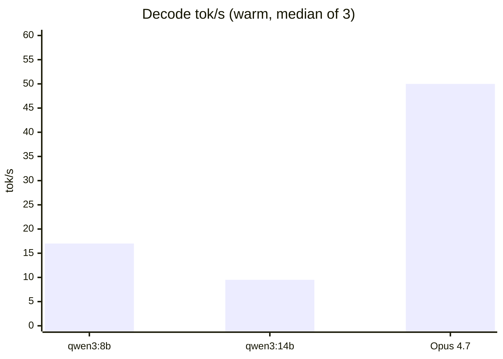

# Benchmark charts

Generated from `benchmarks/results.json`. Re-render with `python benchmarks/charts.py`.

## Overview


## Decode throughput



```
qwen3:8b  ############# 17.0
qwen3:14b ####### 9.5
Opus 4.7  ######################################## 50.0
```

## Tool use

```
qwen3:14b  ######################################## 100% (3/3)
qwen3:8b   ######################################## 100% (3/3)
Opus 4.7   ######################################## 100% (3/3) [reference]
```

## RAG retrieval relevance

```
HIT   dist=17.95  q='Mac mini hardware cost analysis'
HIT   dist=17.38  q='MCP architecture for local deployment'
HIT   dist=18.48  q='local model running on Raspberry Pi'
HIT   dist=15.32  q='compound interest formula'
-> overall: 100% relevance rate (4/4)
```
