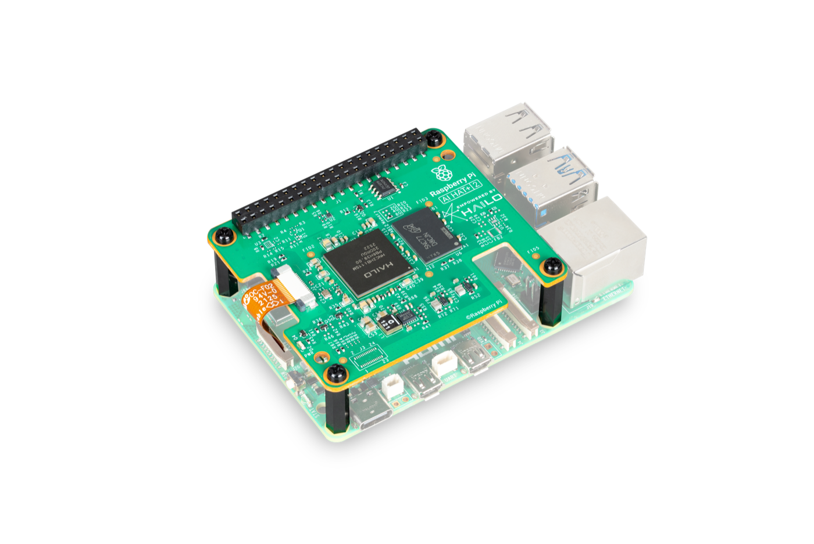
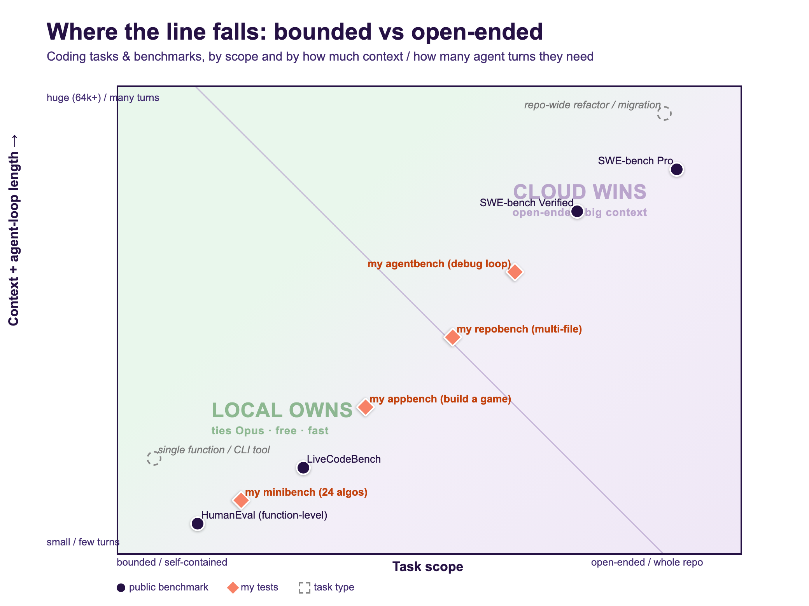
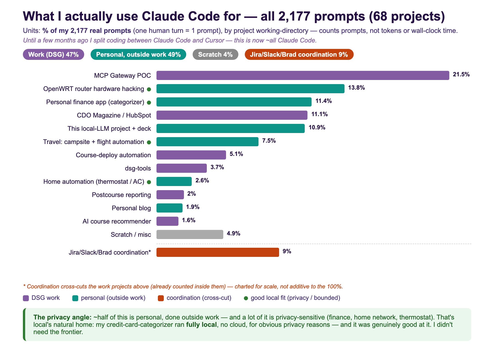

# Can a local LLM replace cloud Claude Code?

Three weeks, three machines: from a Raspberry Pi to a gray-market used Mac Studio.

TL;DR
bounded coding  functionally equivalent, 10x slower

Open-ended repos:  (not quite)

John Connolly, Lead Product Engineer &amp; tinkerer June 2026

<!--
RENDER:  npx @marp-team/marp-cli slides.md -o slides.html --html
PDF:     npx @marp-team/marp-cli slides.md -o slides.pdf --allow-local-files
Presenter view: open slides.html, press `P` (notes are the HTML comments).
DS-branded: white content slides + purple ACT dividers, logo footer, gifs animate.
-->
<!--
[0:30]
SAY: "Three weeks ago I asked a simple question: could I stop paying for cloud Claude Code and run the whole thing on hardware in my house? I spent the price of a used Mac Studio finding out. The short answer is a qualified yes, and the qualification is the whole talk: for bounded coding, local ties the frontier, and it's free; for open-ended repo work, you still want cloud."

CUE: Open cold, don't read the title. Point at the TL;DR box on "bounded" then "open-ended." Set the tone: a measurement talk, not a vibes talk.
-->

---

## Agenda (~30m)

1. **The route:** Raspberry Pi, Air, Studio
2. **Reality check:** you can't buy parity, the hardware call
3. **The measured verdict:** one-shot, agent loop, the build test
4. **Economics, recommendation, caveats**

<!--
[0:30]
SAY: "Four parts. Part one is the route across three machines. Part two, the uncomfortable truth that you can't buy your way to parity. Part three is the heart, the benchmarks, and it's the part that changed my mind. Part four, the money and the recommendation. I'll leave time for questions."

CUE: Don't dwell. If you're running long, Part 1 is the part to compress.
-->

---

## Got a question? Tell me live.

Scan to ask anything, upvote, or drop feedback in real time

app.sli.do/event/9YznQ5rvRQcGAqDi2v8jaW &nbsp;·&nbsp; I'll check it at every part break

<!--
[0:40]
SAY: "This whole talk is about measuring instead of vibing, so hold me to it. Scan this, it's a Slido, ask questions, drop feedback, upvote whatever you want answered, any time, you don't have to wait for the end. I'll check it at every part break and read the top one aloud."

CUE: Before Part One, while people settle. Leave the QR up a beat for the back row.
-->

---

<!-- _class: section -->

PART ONE

# The route: three machines

<!--
[0:05]
SAY: "Part one, the route. How I got from a thirty-five-dollar Raspberry Pi to a gray-market Mac Studio, and what each machine taught me."

CUE: Quick beat, don't linger. SLIDO: glance at the feed, read any new question first.
-->

---

## The question: how capable could a home LLM get?

**"I want to run an LLM at home. How capable could it actually be?"**

- Shoot for the moon! Good enough to be my Claude Code backend, so I can stop paying for cloud.
- Two things to find out:
  - Is it possible, and at what hardware / cost?
  - Is it good enough? Measured, not vibes.

<!--
[1:00]
SAY: "The real question was simple, and a little greedy: I want to run an LLM at home, how capable could it actually get? The bar: good enough to be my Claude Code backend, so I can stop paying for cloud. That splits in two, is it possible, and at what hardware and cost, and is it good enough, measured, not vibes."

CUE: Lead with motivation, not a spec sheet. Plant that "good enough" itself splits later (bounded vs open-ended) with opposite answers. Last bullet is the north star: every number came from a script.
-->

---

## Why start on a Raspberry Pi? Why not?

- Learn by doing, not reading spec sheets
- Already had a Pi (projects with my daughter)
- Ran a small LLM at home. Could it do real dev work?

Raspberry Pi 5 + AI HAT+ 2 · <a href="https://vilros.com/products/raspberry-pi-ai-hat-2">bought from Vilros</a>

<!--
[1:00]
SAY: "I learn by jumping in, not reading a spec sheet. The origin's mundane: I had a Raspberry Pi from tinkering projects with my daughter, and wondered if it could run a little LLM for the house. It did, so I got greedy and asked the real question, could it handle my actual dev workload?"

CUE: The human hook, keeps the Pi from looking naive. When it turns out a dead end, that was intentional, I wanted to feel the limits, not predict them.
-->

---

## Bounded coding vs open-ended repos

| | Bounded coding | Open-ended repos |
|---|---|---|
| Scope | one function, script, or algorithm; a file or a few you already know | a vague bug or feature across a large, unfamiliar codebase |
| Context | small, fits in your head | huge (64k+), must be discovered first |
| Agent loop | few turns, converges fast | many turns, sustained reasoning |
| Examples | a parser, a failing unit test, a data structure, a CLI tool, LeetCode | refactor across the repo, a feature touching 12 files, real SWE-bench |
| Benchmark | **HumanEval, LiveCodeBench** (function-level) | **SWE-bench Verified** (repository-level) |

**Which side does local actually win? Where does cloud stay ahead?**

<!--
[1:00]
SAY: "Two genuinely different jobs. Bounded coding is a self-contained problem you hold in your head and finish in a few turns, a parser, a failing test, a small CLI tool, measured by HumanEval and LiveCodeBench. Open-ended is a vague task across a big unfamiliar codebase, sixty-thousand-plus tokens, many turns, measured by SWE-bench Verified. So which side does local actually win, and where does cloud stay ahead?"

CUE: The whole talk hinges on this. Do NOT answer who-wins yet, that's the payoff. Plant the two-axis framing and let the question hang.
-->

---

## Where does the line fall? (the map we'll test)

Teal circle = my coding tasks, manually classified: they lean open-ended (~40% local / ~60% cloud). Most of my Claude Code use isn't coding at all (ops, Jira/Slack, infra, personal projects) — full 2,177-prompt breakdown next.

<!--
[1:30]
SAY: "I built this chart, then looked at my actual history, 2,177 prompts across 68 projects. The teal circle is my coding tasks: they straddle the line and lean cloud, about sixty percent open-ended, exactly where local is weakest. The bigger surprise, most of what I use Claude Code for isn't even coding, it's ops, Jira and Slack, infra, a finance app, building this deck."

CUE: The teal split is a manual estimate; the full breakdown is next slide. Land it: my Claude Code is more general agent than code generator.
-->

---

## Half work, half personal (outside work)

<!--
[1:30]
SAY: "The full audit, all 2,177 prompts, classified by project. Two headlines. One, it's almost exactly half DSG work, half personal projects outside work. Two, a huge chunk of the personal half is privacy-sensitive, my finances, my home network, my thermostat, and that's local's natural home, the data never leaves the house. And it's not a compromise, when a local model categorized my credit-card charges it was genuinely good, I didn't need the cloud."

CUE: This is why local matters beyond coding, the private bounded-classification work is half my usage.
-->

---

## The route: three machines, three verdicts

| Stop | Hardware | What this stop taught me |
|---|---|---|
| 1 | Raspberry Pi 5 + AI HAT+ 2 (Hailo-10H) | Dead end: only tiny 1-3B LLMs fit, ~7 tok/s (measured). Too small + slow for a coding agent |
| 2 | MacBook Air M2 16GB ('Maral') | Did the grunt work (~5 hrs). qwen3:14b ~10 tok/s, kinda slow |
| 3 | The tuning wall | think:false = ~3x; quant sweep; prompt slim |
| 4 | Reality check | Can you just buy your way to the top? *(Part 2)* |
| 5 | Mac Studio M3 Ultra 96GB | The machine that finally earned its keep *(Part 3)* |

<!--
[1:30]
SAY: "This is the map. Stop one, the Raspberry Pi, a dead end, I'll show you why. Stop two, a spare MacBook Air I call Maral, where I learned everything. Stop three, a tuning wall, and the single best speedup of the project. Stop four, the reality check, can you just buy your way to the top, that's part two. Stop five, the Mac Studio, the machine that finally earned its keep, the verdict's in part three."

CUE: Walk it, don't read every cell. Tease, don't spoil, numbers come later. The lessons are in the trip.
-->

---

## Dead end #1: tilting at windmills

- Verified on the actual board: Pi 5 + Hailo-10H, 40-TOPS (tera-operations per second) INT4 NPU, 8GB on-board, HailoRT. A real gen-AI accelerator.
- It *does* run LLMs: Hailo ships a GenAI model zoo plus Hailo-Ollama, an Ollama/OpenAI-compatible runtime,1,2 so Claude Code can point at the accelerator.
- But the whole LLM zoo is **1-3B** (Llama-3.2-1B, Qwen2.5-1.5B, DeepSeek-R1-1.5B),3 too small for a 64k-context coding agent.
- And it's **slow**: I measured ~7 tok/s on the accelerator; independent reviewers find the Pi CPU often matches it4,5 (Hailo markets 30-50 tok/s,1 not what I, or they, saw).
- **Takeaway:** not a connection problem, a capability one. The models that fit are too small, the speed isn't there. Right edge box, wrong job for a coding agent.

1&nbsp;<a href="https://hailo.ai/blog/bringing-on-device-generative-ai-to-the-pi-when-and-why-youll-need-the-raspberry-pi-ai-hat-2/">Hailo: On-device GenAI on the Pi AI HAT+ 2</a> &nbsp;&nbsp; 2&nbsp;<a href="https://github.com/hailo-ai/hailo_model_zoo_genai">Hailo GenAI Model Zoo (GitHub)</a> &nbsp;&nbsp; 3&nbsp;<a href="https://raspberry.tips/en/raspberrypi-tutorials/raspberry-pi-ai-hat-2-hailo-10h-40-tops-local-llms">raspberry.tips: AI HAT+ 2 local LLMs</a> &nbsp;&nbsp; 4&nbsp;<a href="https://www.cnx-software.com/2026/01/20/raspberry-pi-ai-hat-2-review-a-40-tops-ai-accelerator-tested-with-computer-vision-llm-and-vlm-workloads/">CNX Software: AI HAT+ 2 review</a> &nbsp;&nbsp; 5&nbsp;<a href="https://www.hardware-corner.net/local-llms-raspberry-pi-ai-hat-plus-2/">hardware-corner.net: Local LLMs on the AI HAT+ 2</a>

<!-- Hardware: Adafruit #6451, Raspberry Pi AI HAT+ 2, Hailo-10H, 40 TOPS INT4, 8GB on-board. NOT the original AI HAT+ (Hailo-8/8L). -->
<!--
[1:00]
SAY: "I verified this on the actual board, and to be fair to it, the Hailo does run language models now: Hailo ships a generative-AI model zoo and an Ollama-compatible runtime, so you can point Claude Code at it. So why a dead end? Two reasons, both capability, not connection. One, every model in that LLM zoo is one to three billion parameters, far too small for a sixty-four-thousand-token coding agent. Two, it's slow, I measured about seven tokens a second, and reviewers find the plain CPU often matches it. Hailo markets thirty to fifty, but that's not what I, or they, saw."

CUE: Corrected since I first built this, own that. Takeaway: a capability problem, not a connection one. Sources on the slide.
-->

---

## Showing the work: 2 slow 2 furious

- Measured both paths: CPU (ollama) **5 tok/s** · Hailo accelerator **7.3 tok/s**
- Reviewers: **CPU often beats the Hailo** (R1-1.5B 6.7 vs 9.0 · Coder-1.5B 8.1 vs 10.3 · Llama3.2-3B 2.6 vs 4.8)
- Hailo's real win: low power, not speed
- **Bottom line:** great low-power chatbot, never a coding agent (mine botched "reverse a string")
- Sources: [CNX Software](https://www.cnx-software.com/2026/01/20/raspberry-pi-ai-hat-2-review-a-40-tops-ai-accelerator-tested-with-computer-vision-llm-and-vlm-workloads/) · [hardware-corner.net](https://www.hardware-corner.net/local-llms-raspberry-pi-ai-hat-plus-2/)

"more like an AI decelerator than an AI accelerator" — CNX Software, AI HAT+ 2 review

<!--
[1:30]
SAY: "I measured both paths myself. On the CPU, about five tokens a second on a 3B coder. On the Hailo accelerator, seven-point-three on a 1.5B. Those felt off, so I checked independent reviewers, and the plain CPU often beats the Hailo, one literally called it more like a decelerator than an accelerator. The whole lineup is one to three billion, and when I ran it, it got 'reverse a string' wrong."

CUE: The fun one, let the gif play. The chip's real win is low power, not speed. Great chatbot, never a coding backend.
-->

---

## Maral: a spare 16GB Air, punching above its weight

- qwen3:8b / :14b via Ollama's Anthropic endpoint, wired into Claude Code with one env block
- Plot twists:
  - Tool-use was already at parity with cloud.
  - Real pain wasn't the model, it was memory bandwidth and the WiFi driver crashing under load (rude)
- 16GB is the floor, not a platform. Ran on vibes and about 5 hours of uptime.

**Takeaway:** the model was never the weak link, the hardware was. 16GB is enough to prove the idea, not to live on it.

<!--
[1:30]
SAY: "A spare sixteen-gig MacBook Air carried the whole proof of concept, and it only ran about five hours total. The big surprise: tool-use just worked. Claude Code isn't a chatbot, it drives tools through strict function-calling, and my fear was that a small model would faceplant on the mechanics, malformed JSON, the wrong tool. It didn't, it was at parity with cloud out of the box. The real pain was never the model, it was slow memory and the WiFi driver crashing under pressure."

CUE: Be precise, it nailed the MECHANICS of tool-calling, separate from driving a long loop to the finish, that convergence problem is Part Three. Takeaway: sixteen gigs proves the idea, can't host it. Sets up "what do I buy?"
-->

---

## The single best tuning knob: kill the thinking tax

- Qwen3 emits a `<think>` trace before every answer.
- A coding answer needing 80 tokens cost 600, 8x the work.
- `CLAUDE_CODE_DISABLE_THINKING=1`   (or `{"think": false}`)
- **~3x speedup from one env var.** Everything else I tuned for a week? Secondary.

<!--
[1:30]
SAY: "If you remember one config line, it's this. Qwen3 is a reasoning model, it writes a hidden think-trace before every answer. Great for chat, pure overhead for an agent doing lots of tiny tool calls, an eighty-token edit was costing six hundred. One environment variable turns it off, and you get about a three-times real-world speedup."

CUE: Audience beat, "guess how much all my fancy tuning bought me, versus this one line." Everything else was a rounding error.
-->

---

<!-- _class: section -->

PART TWO

# Reality check & the hardware call

<!--
[0:05]
SAY: "Part two. I've got a working setup, now the uncomfortable part: how good can local actually get, and can you just buy your way to the top? Short answer, no."

CUE: Quick beat. SLIDO: glance at the feed, read any new question first.
-->

---

## Reality check: you can't buy frontier parity

| Tier | Best open weight | SWE-bench Verified | Gap to Opus 4.8 |
|---|---|---|---|
| 96GB Mac (what you'd actually buy) | Qwen3.6-27B (what I benched) | 77.2% | −11 |
| **Cloud-scale only\*** | **DeepSeek-V4 (best open weight, 1.6T)** | **80.6%** | **−8 (still short!)** |
| Cloud | **Opus 4.8** | **88.6%** | 0 |

The best open-weight model won't even fit the biggest Mac Apple will sell you, and it's still 8 points behind Opus in the cloud. **The only thing that gives you Opus quality is Opus.**\*\* ([SWE-bench Verified, llm-stats.com](https://llm-stats.com/benchmarks/swe-bench-verified); same 77.2 / 88.6 in [Local AI is not Opus](https://blog.alexellis.io/local-ai-is-not-opus/))

&ast; DeepSeek-V4 is a 1.6T-param MoE: it won't fit a 512GB Mac, and Apple pulled the 512GB config in March 2026 anyway. Even granting cloud-scale hardware, the best open weight is still −8. &ast;&ast; Not an Anthropic shill, I'm trying to fire my own $200/mo Claude bill. The numbers are just what they are.

<!--
[2:00]
SAY: "Myth-buster: just buy a big enough Mac and you'll match Opus. False. The model I run on the 96-gig box, Qwen 3.6 27B, scores seventy-seven on SWE-bench Verified, eleven behind Opus. The best open-weight model on earth, DeepSeek V4, only reaches eighty-point-six, still eight short, and it won't even fit the biggest Mac Apple sells. You cannot spend your way to parity. The only thing that gives you Opus quality is Opus."

CUE: This is SWE-bench Verified, the hard open-ended-repo axis, exactly where local loses. Footnote: I'm not a shill, I'm trying to fire my own bill.
-->

---

## So the decision is about how close, not parity

- Parity's off the table, so stop chasing it.
- The real question becomes: **how close can I get for sensible money, and what do I do about the gap?**
- Answer that with your actual task mix, not dollars or ideology.
- So I bought a box to find out.

<!--
[1:00]
SAY: "Once parity's off the table, the question changes from 'can I match it' to 'how close can I get for sensible money, and what do I do about the gap?' You answer that with your actual task mix, not ideology and not the sticker price. So I went and bought a box to find out."

CUE: Keep it a QUESTION, do NOT answer it here. Hold the hybrid recommendation and the dollar figure for Part Four, that's the payoff.
-->

---

## The buy: a used M3 Ultra 96GB

- Apple-direct was 4 months backordered (M3 Ultra was EOL'd)
- Every reseller went dry within days, only the grey market left
- Verified a sealed eBay unit (99.3% seller). Wiring four figures to a stranger on eBay is its own personality test.
- **Takeaway:** a just-discontinued machine vanishes from every channel at once.

the box running the LLM

<!--
[1:00]
SAY: "Right as I decided to buy, Apple discontinued the M3 Ultra, so Apple-direct was four months backordered and every reseller drained within days. I ended up on the grey market, a sealed unit on eBay, and I'll be honest, wiring four figures to a stranger on eBay is its own little personality test."

CUE: Breather, tell it like a story. Gesture at the photo, that's the box running the LLM. Takeaway: a just-discontinued machine vanishes from every channel at once.
-->

---

<!-- _class: section -->

PART THREE

# The measured verdict

<!--
[0:05]
SAY: "Part three. Enough story, enough vibes. Here are the actual benchmarks, and this is where it surprised me."

CUE: Build energy here, this is the best part. SLIDO: glance at the feed, read any new question first.
-->

---

## The verdict: local ties cloud on coding

| Model | Score | Speed |
|---|---|---|
| **qwen3-coder:30b (local)** | **24 / 24** | **68 tok/s** |
| Opus 4.8 (cloud) | 24 / 24 | — |
| qwen3:32b dense | 16 / 18 | 20 tok/s (skip) |

Mini-bench: 24 algorithmic problems, easy to LeetCode-hard, deterministic pytest scoring. Local understood the assignment: tied Opus on every one.

<!--
[1:30]
SAY: "Twenty-four coding problems, easy up to LeetCode-hard, scored deterministically with pytest, no model judging itself. The local thirty-billion coder tied Opus on every single one, at sixty-eight tokens a second, for free."

CUE: Stress the rigor before the result. Then plant the honesty coming: this bench saturated, my model couldn't lose on it. Don't oversell, the next slides complicate this.
-->

---

## But a benchmark you can't lose isn't measuring

- coder-30b **and** Opus both went 24/24 — the bench saturated.
- A benchmark your best model can't lose on has stopped telling you anything.
- What it can't see is the axis that matters day to day: long, multi-file, agentic work.
- So I built harder tests. The rest of this part is what they found.

<!--
[1:30]
SAY: "Here's the catch. Both my local model and Opus went twenty-four for twenty-four, so this bench has stopped measuring anything. A benchmark your best model can't lose on is dead weight. What it can't see is the axis that actually bites day to day, long multi-file agentic work in a big unfamiliar repo. So I built harder tests."

CUE: The bridge, NOT the verdict. Keep them in suspense, the verdict lands at the reconciliation at the end of the part.
-->

---

## Why the Studio is fast: bandwidth, not parameters

| Box | Memory bandwidth | coder-30b speed |
|---|---|---|
| MacBook Air M2 16GB | ~100 GB/s | 16 tok/s |
| **Mac Studio M3 Ultra 96GB** | **819 GB/s** | **68 tok/s** |

Same model, 4x faster, purely the memory bus. **MoE (mixture of experts) beats dense:** the dense 32B was mediocre and slow; the 30B MoE activates only 3B params per token, so it streams far less from memory each step, running 3x faster than the dense 32B and scoring higher.

Bandwidth: M3 Ultra [819 GB/s (Apple spec)](https://www.apple.com/mac-studio/specs/); Pi 5 LPDDR4X ~17 GB/s. Same idea, ~48x the bus.

<!--
[1:30]
SAY: "Same model, same quant, eight times the memory bandwidth gives you about four times the tokens per second. The Mac Studio's memory bus is the whole story, it's not about raw compute. And the mixture-of-experts punchline: a thirty-billion MoE that only activates three billion parameters per token beats a dense thirty-two-billion, faster and higher-scoring, because only the active experts stream from memory each token."

CUE: The one technical slide. Buying advice: optimize for memory bandwidth, run MoE, don't chase GPU teraflops.
-->

---

## Bonus: one box = a full local AI server

With `OLLAMA_MAX_LOADED_MODELS=3`, all resident at once (~38GB, 50GB free):

- coder-30b, the coding agent
- qwen2.5-VL, vision / OCR
- nomic-embed, RAG (retrieval-augmented generation) embeddings

Plus qwen3-next:80b (80B, 64 tok/s, bigger brain, same speed).

<!--
[1:00]
SAY: "Ninety-six gigs holds the coding agent, a vision model, and an embedding model for search, all resident at once, thirty-eight gigs used, fifty free. So one box is the coding, vision, and retrieval backend for the whole house. And the eighty-billion model runs at the same speed as the thirty-billion, because both activate only three billion parameters per token, a free quality upgrade with no speed penalty."

CUE: Brisk, it's a value-add, not the core argument. Don't dwell.
-->

---

## But the agent loop is where local gets cooked

| | pass | avg wall-clock | turns (range) |
|---|---|---|---|
| **Cloud (Opus)** | **5 / 5** | **31 s** | 5-9 (stable) |
| **Local (coder-30b)** | 4 / 5 | **248 s** | **4-41 (wild)** |

5 multi-file bug-fixes through the real Claude Code agent loop. **Local 8x slower, a one-line `>` to `>=` fix took it 41 turns / 584 s.**

<!--
[2:00]
SAY: "The one-shot benchmarks said tie. But I wanted to measure what I actually feel day to day, so I drove the real Claude Code agent loop on five multi-file bug fixes, local versus Opus. Cloud, five out of five, about thirty-one seconds, rock-steady. Local, four out of five, but two hundred forty-eight seconds, eight times slower, and wildly unstable, four to forty-one turns. One of these was a one-line fix, a greater-than to a greater-than-or-equal, and local took forty-one turns and almost ten minutes flailing on it."

CUE: THE turning point, give it room. Pause after the 41-turn line, let it hang. The lesson: measure the agent loop, not tokens per second.
-->

---

## Watch it: the agent loop side by side

Real runs at 8x speed: left flails to 9 turns/110s, right is clean at 5 turns/17s.

<!--
[1:00]
SAY: "Same one-line bug. The cloud agent, on the right, has been done for ninety seconds while the local one, on the left, is still grinding."

CUE: Let it play silent the first few seconds. Point at the moment the right side freezes green. This is a recording of the real runs, sped up eight times, not a mockup.
-->

---

## It's not caching, it's convergence

- Ollama **does** prefix-cache; the big token counts are CC's accounting, not re-compute
- Real cost = turn-count instability: the 30B swings 4-41 turns
- Cloud converges in 5, every time
- The "68 tok/s, ties Opus" number was single-turn. It hid all of this.

<!--
[1:30]
SAY: "My first theory was, local has no prompt caching, so it re-computes everything. Wrong. Ollama does cache, about thirty thousand tokens cached, only two hundred fifty new per turn, the scary big numbers were just Claude Code's accounting display. The real culprit is convergence: the thirty-billion model can't reliably drive a tool-loop to the finish. And that headline sixty-eight-tokens-a-second, ties-Opus number was single-turn, it hid all of this."

CUE: Use the honest "I was wrong" beat, it builds trust. Meta-point: single-turn benchmarks hide multi-turn instability. That's why you measure the loop.
-->

---

## Tested it: the instability was the model

| same agent loop, same box | pass | turns | avg time |
|---|---|---|---|
| coder-30b (the deck's baseline) | 4 / 5 | **4-41 (wild)** | 248 s |
| Qwen 3.6 27b (q8) | 5 / 5 | 7-9 | 161 s |
| **gpt-oss 20b** | **5 / 5** | **7-9 (stable)** | **48 s** |
| gemma4 26b | 5 / 5 | 8-20 | 69 s |
| Opus 4.8 (cloud) | 5 / 5 | 5-9 | 31 s |

Every current model is stable and 5/5, the 41-turn coder spiral was a stale model, not local inference. **gpt-oss 20b lands within ~1.5x of cloud**, stable, on a 20B model. The fix was a newer model, not a bigger box.

<!--
[1:30]
SAY: "Hypothesis from Boykis and Hacker News: maybe that instability is the model, not local inference. So I tested it, same box, same five tasks, swapped my last-gen coder for Qwen three-six, same quant, only the model changed. Five out of five, every task seven to nine turns, dead stable, like cloud. The forty-one-turn spiral became seven. The fix was a newer model, not a bigger box. And gpt-oss 20b lands within about one-and-a-half times cloud."

CUE: The payoff: maybe it's software, not hardware. Honest caveat, still slower than cloud, but stable and correct. Most important update since I built the deck.
-->

---

## But on open-ended building, the gap collapses

| backend | playable | build time | turns | cost |
|---|---|---|---|---|
| Opus 4.8 (cloud) | **7 / 7** | 50 s | 2 | $0.40 |
| qwen3-next:80b (local) | **7 / 7** | 98 s | 2 | **$0** |
| qwen3-coder:30b (local) | 6 / 7 | 166 s | 2 | **$0** |

Task: 'build playable Space Invaders as one index.html', scored by a Playwright 7-check rubric. **No failing test to spiral on, so local 80B ties cloud, within 2x on speed.**

<!--
[1:30]
SAY: "Remember the eight-times tax was specifically about debugging, chasing a failing test, where instability compounds. So I tried the opposite: build a playable Space Invaders in one HTML file, scored by an automated browser rubric. On a build-from-scratch task the gap nearly closes, the local eighty-billion gets a perfect seven out of seven, same as Opus, at twice the wall-clock and zero dollars."

CUE: The most hopeful data, lift the energy. The bigger local model beat the smaller one on speed AND quality AND tokens. Takeaway: route by task type, build is great for local, debug-a-repo is where cloud earns its keep.
-->

---

## Same task, three models, all playable

The actual games the agents built. Polish climbs left to right. coder-30b gatekept its own game behind a START menu.

<!--
[1:00]
SAY: "These are the actual games the three agents built, being played by a script. The polish climbs left to right and maps exactly to the table, but the point is all three are real, runnable, in the repo, and the local ones cost zero dollars."

CUE: Show, don't tell, let it loop. Left = small local (shipped behind a START menu, its one miss); middle = eighty-billion; right = Opus, richest. Invite them to clone and play.
-->

---

## Concrete: real DSG tasks, local vs cloud wall-clock

| Task (internal-web-app stack) | Type | Cloud | Local | Slower |
|---|---|---|---|---|
| Write an ECR Terraform module | bounded | **19 s** | **186 s** | **~10x** |
| Scaffold an ECS Fargate service module | build | **36 s** | **256 s** | **~7x** |
| Fix an ALB OIDC header parser (failing test) | debug | **29 s** | **154 s** | **~5x** |

Local got the **right answer on every run** (same capability), but you **wait ~5-10x longer**. The gap shrinks as tasks get bigger: bounded is *worst* (~10x) because cloud finishes it in ~19s, so local's per-turn latency is a bigger multiple.

Mean of 3 runs each (warm); local passed all 9. qwen3.6:27b (q8) on the Studio vs Opus 4.8, real `claude -p` loop. Sandboxed: throwaway dirs, AWS creds stripped, nothing deployed. A faster local model (gpt-oss:20b) narrows the gap.

<!--
[1:30]
SAY: "Three real tasks shaped like my own DSG infra: a bounded ECR Terraform module, a build, scaffolding a whole ECS Fargate service, and a debug, fixing a planted bug with a failing test. Each ran three times, local versus cloud, fully sandboxed. Local got the correct answer on all nine runs, same capability. But you wait, five to ten times longer. And the twist, the bounded task is the worst ratio, about ten-x, because cloud finishes it in twenty seconds and local's per-turn latency is a bigger multiple of a tiny number."

CUE: The honest counterweight to tokens-per-second. Means of three runs, low variance. "Local ties" is about whether the answer is right, not how long you wait. gpt-oss narrows the gap.
-->

---

## The reconciliation

| Workload | Local verdict |
|---|---|
| One-shot bounded coding | **Ties Opus** on capability; ~10x slower wall-clock, free |
| Multi-turn debug loops | **Current models stable, 5/5; gpt-oss 20b within ~1.5x of cloud** |
| Open-ended building (from scratch) | **80B ties cloud, ~2x slower, $0** |
| Open-ended repo work (big context) | **Cloud still wins, on capability** |

The 41-turn instability was a stale-model artifact; a current model is stable and 5/5. What's left is wall-clock, and it's **model-dependent**: ~1.5x on gpt-oss 20b, ~5-10x on qwen3.6/coder (my dsgbench numbers used the slower qwen3.6). Plus big-context repo work. **Measure the agent loop, keep your model current, route by task.**

<!--
[1:00]
SAY: "Everything Part Three measured, in one table. One-shot bounded, ties Opus, fast and free. Multi-turn debug loops, current models are stable and five-for-five, gpt-oss within about one-and-a-half times cloud. Open-ended building from scratch, the local eighty-billion ties cloud at twice the wall-clock and zero dollars. Open-ended repo work across big unfamiliar context, cloud still wins on raw capability. The spine of it: local is genuinely capable on most of what I do, and cloud still earns its keep on the hardest repo work, both true at once."

CUE: The part-end synthesis, land it slowly. This is the verdict the whole part built to. Let it sit, then move to the money.
-->

---

<!-- _class: section -->

PART FOUR

# Economics & the call

<!--
[0:05]
SAY: "Part four. So what does this actually cost, and what should you do on Monday morning?"

CUE: Quick beat. SLIDO: glance at the feed, read any new question first.
-->

---

## The economics

- Cloud: ~$200/mo, about $2,400/yr, indefinitely
- Local: one up-front cost, then **$0/mo** after
- **Breakeven ~2 years**, then it's basically free real estate, for the work local handles well
- Privacy bonus: code never leaves the LAN
- The catch: it's a supplement, not a full replacement. Hard repo work still routes to cloud.

<!--
[1:00]
SAY: "Cloud is about two hundred a month, forever. The box is a one-time cost, then zero. Breakeven is roughly two years, and after that it's pure savings, but be honest, only for the slice of work local handles well. It shrinks the cloud bill, it doesn't zero it. The non-money win that often matters more: code never leaves your network, and for client or regulated work that can justify the box on its own."

CUE: The money slide, what a decision-maker wants. Keep saying "supplement, not replacement," that's what keeps it from sounding like a sales pitch.
-->

---

## Recommendation

**Hybrid, not either/or:**

- `claude` routes to the local Studio (the 80%: daily coding, free, private, fast)
- `claude-cloud` routes to Opus 4.8 (the 20%: hard cross-file repo work)

One toggle, per task. Denominated in your real workload.

**Single-dev sweet spot:** Mac Studio, **64-96GB**, MoE coder model, a few thousand.

<!--
[1:00]
SAY: "The whole talk reduces to one architecture: hybrid. Two shell aliases, one routes to the local Studio, one routes to Opus, you pick per task, no lock-in. The buying advice: a single developer wants a Mac Studio, sixty-four to ninety-six gigs, an MoE coder model, a few thousand dollars. Not the parity-chase box I debunked in Part Two, not the sixteen-gig toy from Part One."

CUE: The actionable takeaway, Monday morning. If someone photographs one slide, it's this one, hold it an extra beat.
-->

---

## Caveats that matter

- 'Local SOTA at home' is real in 2026, narrowly, on bounded coding
- On open-ended engineering it is not, and no honest setup pretends otherwise
- 16GB is too small; 96GB+ is overkill for one person
- Benchmarks saturate, measure your task mix, not a leaderboard

<!--
[1:00]
SAY: "Let me name my own weaknesses first. 'Local SOTA at home' is true only if you append 'narrowly, on bounded coding.' On open-ended engineering it's not, and no honest setup pretends otherwise. Sixteen gigs is too small to live on, more than ninety-six is overkill for one person. And benchmarks saturate, the only one that matters is your own task mix."

CUE: Q&A insurance, pre-answer the hostile questions by naming the weaknesses yourself.
-->

---

## What's next (this is being measured)

- Cut my agents fully over to local
- Measure local vs Opus 4.8 on real tasks: token usage, latency, TTFT (time to first token), success
- Add verification-loop scaffolding: guardrails took an 8B from 53% to 99% on agentic workflows ([Forge, Show HN](https://news.ycombinator.com/item?id=48192383))
- The instability may be a software problem, not a model-size one. The fix might be code, not a $10k box.

<!--
[1:00]
SAY: "This is live research, not a post-mortem. Three threads: cut my real agents fully over to local, keep the measurement rig running on real daily tasks, and the exciting one, add verification-loop scaffolding. Published results show guardrails took an eight-billion-parameter model from fifty-three percent to ninety-nine percent on agentic workflows. So the instability we measured might be a software problem, not a model-size one, the fix could be code, not a ten-thousand-dollar box."

CUE: End on momentum. That last reframe turns the weakness into something solvable, leaves the room optimistic.
-->

---

## Stumbling blocks (learned the hard way)

- **Swapping models mid-conversation = instant `API Error: 400`.** Claude Code replays the whole stored history (tool blocks, cache, system prompt); it no longer matches the new backend. Fix: `/clear` or a fresh session per swap.
- **Low quant silently breaks tool-calling.** q4 degrades the agent loop, not just the prose; q6 is the agentic sweet spot.
- **Forgetting `think:false`** = an invisible ~3-8x token + latency tax. One env var, easy to leave off.
- **A stale model IS the instability.** A last-gen coder spiraled to 41 turns on a 1-line fix; a current model did it in 7. Re-bench monthly, the field moves weekly.
- **Ollama traps:** restarting the service kills an in-flight `ollama pull`; `ollama ps` reads empty (0.30.7 display bug, check `ps aux | grep llama-server`); needs the full `Resources/` dir or it 500s.
- **16GB is a demo, not a platform:** the WiFi driver crashed under memory pressure, and the bus starves the model.

<!--
[1:00]
SAY: "The potholes, so you skip the pain. The one that gets everybody: swap the model mid-conversation in Claude Code and you get an instant 400, because it replays the whole stored history and it no longer matches the new backend. Fix is dumb-simple, clear the session. Low quant quietly degrades tool-calling, run q6 not q4. Forgetting think-false is a silent tax. A stale model was the instability, re-bench monthly. And sixteen gigs is a demo, not a platform."

CUE: None are dealbreakers, they're potholes, now you know where they are.
-->

---

<!-- _class: section center -->
# The win is real. So is the caveat.

Repo + full write-up: github.com/jconnolly/local-llm-pi5

Benchmarks: minibench · repobench · appbench

<!--
[0:30]
SAY: "The win is real, and the caveat is real too. Everything's in the repo, reproducible, the benchmarks are real code you can clone and run. Let's open it up."

CUE: Say the thesis slowly. Q&A to expect: why not vLLM/MLX for speed, why not always run the 80B, would guardrails fix it, ROI if already paying cloud. Answers are in Parts Three and Four. ~30 min here = nailed the pacing.
-->

---
## PS: the field moved while I built this deck

- Mid-build, **Vicki Boykis** published *Running local models is good now* (Jun 15) + a 1,589-pt HN thread.
- Corroborates the core finding: context is the wall, ~30B MoE is the sweet spot, agentic local is model-dependent.
- My models are already last-gen — community's on **Qwen 3.6** and **Gemma 4**.
- **Already tested:** re-ran the loop on Qwen 3.6 / gpt-oss / Gemma 4 — all 5/5, stable. **gpt-oss within ~1.5x of cloud.**
- **Still open:** quant (q6 vs q4 on the 80B), living on it daily. The verdict holds; the models won't.
- Sources: [Boykis blog](https://vickiboykis.com/2026/06/15/running-local-models-is-good-now/) · HN [discussion](https://news.ycombinator.com/item?id=48555993) · [thread](https://news.ycombinator.com/item?id=48542100)

<!--
[0:30]
SAY: "One honest footnote. While I was literally building this deck, Vicki Boykis published almost exactly this argument, and Hacker News spent fifteen hundred points debating it the same week. It corroborates the structure, that's not just me. The humbling part: my specific models are already a step behind, the community's on Qwen three-six and Gemma four now. So the verdict holds, but the numbers have a one-week shelf life."

CUE: The closer-after-the-closer, only if time allows. People flagged low quant weakens tool-calling, possibly the real instability cause.
-->

---

## Appendix: my 4 benchmarks (all reproducible, in the repo)

| Benchmark | What it tests | Scoring | Axis |
|---|---|---|---|
| minibench | 24 algorithmic problems, easy to brutal (LeetCode-hard) | hidden pytest, no LLM judge | bounded (function-level) |
| repobench | multi-file bugs, subtle off-by-ones (4 moderate + 5 hard) | hidden pytest | middle (multi-file) |
| appbench | build a playable game in one index.html (Space Invaders) | Playwright 7-check rubric | bounded build, long-horizon |
| agentbench | the real Claude Code agent loop on multi-file bug-fixes | re-run tests + turns / time / cost | agentic (multi-turn) |

Not a replacement for [SWE-bench Verified](https://www.swebench.com/verified.html) (real GitHub issues across huge repos). Small, deterministic, reproducible probes to map the bounded-to-open-ended axis. minibench ≈ HumanEval/LiveCodeBench; agentbench + repobench ≈ a controlled mini-SWE-bench. Full code: [github.com/jconnolly/local-llm-pi5](https://github.com/jconnolly/local-llm-pi5/tree/main/benchmarks)

<!--
[1:00]
SAY: "Four small benchmarks, all in the repo, all deterministic, no model grading a model. minibench is the bounded function-level axis, like HumanEval. repobench and agentbench move toward open-ended and agentic, a controlled mini-SWE-bench. appbench is the long-horizon build. The honest caveat: these aren't SWE-bench Verified, mine are smaller, but they're reproducible on my own hardware and they agree with the public leaderboards."

CUE: Appendix, for the methodology-curious and Q&A.
-->

---

## Appendix: minibench's 24 problems

| Tier | Problems |
|---|---|
| Easy (3) | valid parentheses, two-sum, roman to integer |
| Medium (3) | merge intervals, longest unique substring, spiral matrix |
| Hard (6) | word break, coin change, LRU cache, edit distance, trapping rain water, median of two sorted arrays |
| Expert (6) | regex matching, N-queens, basic calculator, longest increasing subsequence, min path sum, decode ways |
| Brutal (6) | Dijkstra, calculator with parentheses, longest palindromic subsequence, buy/sell stock (k txns), word ladder, eval RPN |

All scored deterministically with hidden pytest tests, no LLM judge. coder-30b and Opus both went 24/24. Full prompts + tests: [github.com/jconnolly/local-llm-pi5/.../minibench](https://github.com/jconnolly/local-llm-pi5/tree/main/benchmarks/minibench)

<!--
[0:45]
SAY: "The twenty-four, grouped easy to brutal. Two-sum and valid-parens at the easy end, Dijkstra, word-ladder, a recursive-descent calculator at the brutal end. Hidden pytest, deterministic, no model judging. Local coder and Opus both went twenty-four for twenty-four, which is exactly why I needed harder open-ended tests, this bench saturated."

CUE: Full list and tests in the repo.
-->
