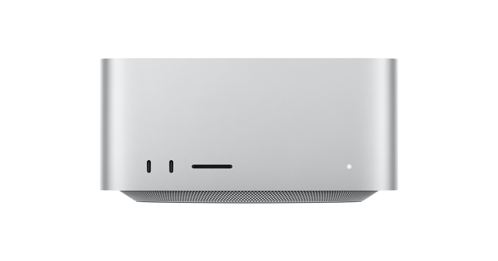
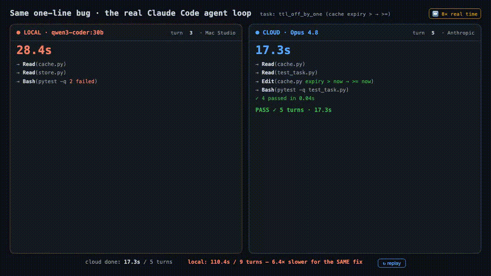
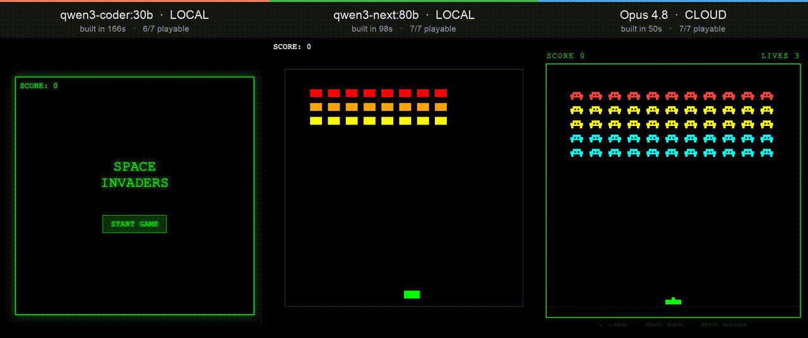

# Can a local LLM replace cloud Claude Code?

Three weeks, three machines: from a Raspberry Pi to a $4,676 Mac Studio.

TL;DR

bounded coding  (ties the frontier, free)

Open-ended repos:  (not quite)

John Connolly, Lead Product Engineer &amp; tinkerer June 2026

<!--
RENDER:  npx @marp-team/marp-cli slides.md -o slides.html --html
PDF:     npx @marp-team/marp-cli slides.md -o slides.pdf --allow-local-files
Presenter view: open slides.html, press `P` (notes are the HTML comments).
DS-branded: white content slides + purple ACT dividers, logo footer, gifs animate.
-->
<!--
0:30 | Open cold, don't read the title. Say: 'Three weeks ago I asked a simple question, could I stop paying for cloud Claude Code and run the whole thing on hardware in my house. I spent $4,676 finding out.' Then point at the TL;DR box: the answer is a qualified yes, and the qualification is the entire talk. For bounded coding, local ties the frontier and it's free. For open-ended repo work, you still want cloud. Everything after this slide is me earning that one sentence with data. Set the tone: this is a measurement talk, not a vibes talk, every claim has a benchmark behind it.
-->

---

## Agenda (~29 min)

| Act | Topic | ~min |
|---|---|---|
| **1** | The route: Raspberry Pi, Air, Studio | 7 |
| **2** | Reality check: you can't buy parity. The $4,676 call | 5 |
| **3** | The measured verdict: one-shot, agent loop, the build test | 12 |
| **4** | Economics, recommendation, caveats | 5 |

<!--
0:30 | Don't dwell. Four acts. Act 1 is the journey across three machines, that's the story. Act 2 is the uncomfortable truth that you can't buy your way to parity. Act 3 is the heart, the actual benchmarks, and it's where the surprise lives, so flag it now: 'Act 3 is the part that changed my mind.' Act 4 is the money and the recommendation. Tell them you'll leave time for Q&A. If you're running long, Act 1 is the part to compress.
-->

---

<!-- _class: section -->

ACT ONE

# The route: three machines

<!--
5 sec | Quick beat, don't linger on dividers. Say: 'Act One, the route. How I got from a thirty-five-dollar Raspberry Pi to a forty-six-hundred-dollar Mac Studio, and what each machine taught me.' Then move.
-->

---

## Why start on a Raspberry Pi? Why not?

- I learn by jumping in and getting my hands on the thing.
- I already had a Raspberry Pi from tinkering projects with my daughter.
- Could it run a little LLM for the house? It did, so I got greedy: could it handle my actual dev workload?

<!--
1:00 | The human hook, and it matters because it stops the Raspberry Pi from looking naive. I learn by jumping in, not reading a spec sheet. The origin is mundane: I had a Raspberry Pi from tinkering projects with my daughter, and wondered if it could run a little LLM for the house. It did, so I got greedy and asked the real question, could it handle my actual dev workload. That escalating curiosity is the whole talk. So when the Pi is a dead end, that isn't naive, it was intentionally myopic, I wanted to see the limits with my own eyes, not predict them from a datasheet.
-->

---

## The question

- Can I run a 'SOTA' local LLM at home, usable as my Claude Code backend, and stop paying for cloud?
- Two things to find out:
  - Is it possible, and at what hardware/cost?
  - Is it good enough, measured, not vibes?

<!--
1:00 | Two real questions here. 'Possible' turned out to be the easy one, spoiler, yes, it works on modest hardware. The hard one is 'good enough,' and the whole talk hinges on the fact that good-enough splits in two: good enough for a single bounded task, versus good enough for a long multi-turn agent loop. Those give opposite answers. Plant the seed: 'hold onto the idea that good enough depends on which good.' And the last bullet is the north star, measured, not vibes. Every number you'll see came from a script, not a feeling.
-->

---

## The route: three machines, three verdicts

| Stop | Hardware | Verdict |
|---|---|---|
| 1 | Raspberry Pi 5 + AI HAT+ 2 (Hailo-10H) | Dead end: Hailo runs vision; LLMs fall to the Pi CPU at ~5 tok/s (measured) |
| 2 | MacBook Air M2 16GB ('Maral') | Did the grunt work (~5 hrs). qwen3:14b ~10 tok/s, kinda slow |
| 3 | The tuning wall | think:false = ~3x; quant sweep; prompt slim |
| 4 | Reality check | Frontier parity NOT purchasable locally at any price |
| 5 | Mac Studio M3 Ultra 96GB ($4,676) | Ties Opus on coding @ 68 tok/s, $0/mo |

<!--
1:30 | This is the map, don't read every cell, walk it. Stop one, the Raspberry Pi, total dead end, I'll explain why in two slides. Stop two, a spare MacBook Air I call Maral, that's where I learned everything even though it only ran a few hours. Stop three, I hit a tuning wall and found the single best speedup of the whole project. Stop four, the reality check, the thing you cannot buy at any price. Stop five, the Mac Studio, which finally ties Opus on coding at sixty-eight tokens a second for zero dollars a month. The takeaway line: the lessons are in the trip, not just the destination.
-->

---

## Dead end #1: a valiant vision box, wrong job

- Verified on the actual board (I SSH'd in): Pi 5 + Hailo-10H, 40-TOPS (tera-operations per second) INT4 NPU (neural processing unit), 8GB on-board, HailoRT 5.1.1. A real gen-AI accelerator.
- But every model compiled to the Hailo is **vision** (YOLO, ResNet). Using it for LLMs needs Hailo's own build pipeline (`simple_llm_chat`), not a drop-in OpenAI/Ollama endpoint.
- The connectable path is **ollama on the Pi 5 CPU** (port 11434, qwen2.5-coder 3b/7b). Claude Code can point at it, but it's the slow CPU, not the accelerator.
- **Measured on the box: qwen2.5-coder:3b = 5 tok/s on the Pi CPU.** Too slow, and 3-8B / small context is too small for a 64k-context coding agent.
- **Lesson:** the accelerator is real, but there's no fast, drop-in LLM endpoint, the easy path is the slow CPU. Right edge box, wrong job for a coding agent.

<!-- Hardware: Adafruit #6451, Raspberry Pi AI HAT+ 2, Hailo-10H, 40 TOPS INT4, 8GB on-board. NOT the original AI HAT+ (Hailo-8/8L). -->
<!--
1:00 | The cautionary tale, and I verified it on the actual hardware. The board is genuinely capable, a Hailo-10H, forty INT4 TOPS, eight gigs of its own memory, a real edge gen-AI accelerator. So why a dead end? Two things I confirmed by SSHing into the box. One, every model actually compiled onto the Hailo is a vision model, YOLO and ResNet, using it for language models needs Hailo's own build pipeline, not a drop-in endpoint. Two, the path that IS drop-in, ollama on the Pi, runs on the CPU not the accelerator, and I measured it at about five tokens a second on a three-billion coder model. Five tokens a second, small model, small context. Fine for a chatbot demo, unusable as a coding agent. So it's not that you can't connect, it's that the connectable path is the slow CPU and the fast path only runs vision. Right edge box, wrong job.
-->

---

## Showing the work: 2 slow 2 furious

- I SSH'd in and measured both paths myself. qwen2.5-coder:3b on the Pi 5 CPU (ollama): **5 tok/s**. Qwen2.5-1.5B on the Hailo accelerator itself: **7.3 tok/s** (downloaded the HEF, ran it).
- The numbers felt sus, so I checked independent reviewers, and **the plain CPU often beats the Hailo on LLMs:**
  - DeepSeek-R1 1.5B: 6.7 (Hailo) vs 9.0 (CPU). Qwen2.5-Coder 1.5B: 8.1 vs 10.3. Llama3.2 3B: 2.6 vs 4.8.
- Its real win is offloading the CPU and sipping power, not speed.
- **Bottom line:** the whole Hailo LLM zoo is 1-3B (yes, a 1.5B coder), and the accelerator can't beat the CPU. (Mine even botched "reverse a string".) Great low-power chatbot, never a coding agent.
- Sources: [CNX Software](https://www.cnx-software.com/2026/01/20/raspberry-pi-ai-hat-2-review-a-40-tops-ai-accelerator-tested-with-computer-vision-llm-and-vlm-workloads/) + [hardware-corner.net](https://www.hardware-corner.net/local-llms-raspberry-pi-ai-hat-plus-2/)

"more like an AI decelerator than an AI accelerator" — CNX Software, AI HAT+ 2 review

<!--
1:30 | The fun one, fully verified. I SSHed into the actual Pi and measured both paths myself. The easy path, ollama on the CPU, about five tokens a second on a 3B coder. The fancy path, I downloaded the model onto the Hailo accelerator and ran it, seven-point-three tokens a second on a 1.5B. Then, because those numbers felt sus, I checked independent reviewers, and the plain Pi CPU often beats the Hailo on language models. One literally called it more like an AI decelerator than an accelerator. The chip's real benefit is offloading the CPU and low power, not speed. So the whole lineup is one-to-three-billion, there's even a 1.5B coder, the accelerator can't beat the CPU, and when I ran it the model got 'reverse a string' wrong. Two slow, two furious. Great low-power chatbot, never a coding backend. Sources on the slide.
-->

---

## Maral: a spare 16GB Air, doing the most

- qwen3:8b / :14b via Ollama's Anthropic endpoint, wired into Claude Code with one env block
- Plot twists:
  - Tool-use was already at parity with cloud. The worry? Misplaced.
  - Real pain wasn't the model, it was memory bandwidth and the WiFi driver crashing under load (rude)
- 16GB is the floor, not a platform. Ran on vibes and about 5 hours of uptime.

<!--
1:30 | The workhorse chapter, keep it light. A spare sixteen-gig MacBook Air, I call it Maral, carried the whole proof of concept, and honestly it only ran about five hours total. Two surprises worth landing. One, tool-use, the thing I was most worried about, just worked, parity with cloud out of the box. Two, the pain was never the model's intelligence, it was the memory bus being slow and the WiFi driver literally crashing under memory pressure. So the lesson: sixteen gigs is the floor where you can prove the idea, but it is not a platform you can live on, it ran on vibes. That sets up the obvious question: okay, what do I actually buy?
-->

---

## The single best tuning knob: kill the thinking tax

- Qwen3 emits a `<think>` trace before every answer.
- A coding answer needing 80 tokens cost 600, 8x the work.
- `CLAUDE_CODE_DISABLE_THINKING=1`   (or `{"think": false}`)
- **~3x speedup from one env var.** Everything else I tuned for a week? Secondary.

<!--
1:30 | If they remember one config line from the whole talk, it's this one. Qwen3 is a reasoning model, it writes a hidden think trace before every answer. For chat that's great, for an agent doing lots of tiny tool calls it's pure overhead, an eighty-token edit was costing six hundred tokens. One environment variable turns it off and you get roughly a three-times real-world speedup. Audience beat: 'guess how much speedup all my fancy tuning, the quant sweeps, the cache settings, actually bought me. Now guess how much this one line bought me.' Everything else was a rounding error next to this.
-->

---

<!-- _class: section -->

ACT TWO

# Reality check & the $4,676 call

<!--
5 sec | Quick beat. Say: 'Act Two. I've got a working setup, now the uncomfortable part, how good can local actually get, and can you just buy your way to the top? Short answer, no.' Move.
-->

---

## Reality check: you can't buy frontier parity

| Tier | Best model you can run | SWE-bench Verified | Gap to Opus 4.8 |
|---|---|---|---|
| 96GB Mac | Qwen3.6-27B (what I benched) | 77.2% | −11 |
| **512GB ($11.5K)** | **DeepSeek-V4 (best open weight)** | **80.6%** | **−8 (still short!)** |
| Cloud | **Opus 4.8** | **88.6%** | 0 |

Even the best open-weight model, on an $11.5K box, is 8 points behind Opus. **The only thing that gives you Opus quality is Opus.** ([SWE-bench Verified, llm-stats.com](https://llm-stats.com/benchmarks/swe-bench-verified); same 77.2 / 88.6 in [Local AI is not Opus](https://blog.alexellis.io/local-ai-is-not-opus/))

<!--
2:00 | The hinge, now with verified numbers I actually looked up. Myth-buster: 'just buy a big enough Mac and you'll match Opus' is false. The model I run on the 96GB box, Qwen 3.6 27B, scores seventy-seven on SWE-bench Verified, eleven behind Opus. Max out to a 512GB box and the best open-weight model on earth, DeepSeek V4, gets you to eighty-point-six, still eight short. You cannot spend your way to parity. The only thing that gives you Opus quality is Opus. Note this is SWE-bench Verified, the hard open-ended-repo axis, exactly where local loses, consistent with the rest of the talk where local ties on bounded work.
-->

---

## So the decision is about how close, not parity

- Don't chase a number that isn't for sale
- **Buy hardware for the 80%; keep an explicit `claude-cloud` for the 20%**
- Denominate the choice in your actual task mix, not dollars or principle
- Sweet spot for one dev: **~$4-5K, one Mac Studio, 96GB**

<!--
1:00 | The reframe. Once parity is off the table, the question changes from 'can I match it' to 'how close can I get for sensible money, and what do I do about the gap.' The answer is hybrid: buy hardware for the eighty percent of work you do every day, keep a cloud escape hatch for the hard twenty percent. The discipline: decide on your actual task mix, not on ideology and not on the sticker price. Don't buy local because it's cool, don't avoid it because cloud is easier. And I'll say the number out loud now so it's not a surprise later: for one developer, the sweet spot is about four to five thousand dollars, a single ninety-six-gig Mac Studio.
-->

---

## The buy: $4,676 for a used M3 Ultra 96GB

- Apple-direct was 4 months backordered (M3 Ultra was EOL'd)
- Every reseller went dry within days, only the grey market left
- Verified a sealed eBay unit (99.3% seller); $4,299 + tax. Wiring $4,676 to a stranger is its own personality test.
- **Lesson:** a just-discontinued machine vanishes from every channel at once.

the box running the LLM

<!--
1:00 | Breather, tell it like a story. Right as I decided to buy, Apple discontinued the M3 Ultra, so Apple-direct was four months backordered and every reseller drained within days. I ended up on the grey market, a sealed unit on eBay, ninety-nine-point-three percent seller, strong buyer protection. Be honest about the feeling: wiring four thousand six hundred dollars to a stranger on eBay is its own little personality test. The transferable lesson: a just-discontinued Apple machine vanishes from every channel at once, so if you want a specific config, buy it before the refresh rumor hits. And gesture at the photo: that's the box, that's what's running the LLM.
-->

---

<!-- _class: section -->

ACT THREE

# The measured verdict

<!--
5 sec | Quick beat, but build energy here, this is the best part. Say: 'Act Three. Enough story, enough vibes. Here are the actual benchmarks, and this is where it surprised me.' Move.
-->

---

## The verdict: local ties cloud on coding

| Model | Score | Speed |
|---|---|---|
| **qwen3-coder:30b (local)** | **24 / 24** | **68 tok/s** |
| Opus 4.8 (cloud) | 24 / 24 | — |
| qwen3:32b dense | 16 / 18 | 20 tok/s (skip) |

Mini-bench: 24 algorithmic problems, easy to LeetCode-hard, deterministic pytest scoring. Local understood the assignment: tied Opus on every one.

<!--
1:30 | Open Act Three on the win, this is the 'yes' half of the answer. Stress the rigor before the result: twenty-four coding problems, easy up to LeetCode-hard, scored deterministically with pytest, no model judging itself. The result, the local thirty-billion coder tied Opus on every single problem, at sixty-eight tokens a second, for free. But plant the honesty that's coming: this bench saturated, my local model couldn't lose on it, and a benchmark your best model can't lose on has stopped measuring anything. That's exactly why I had to build harder tests, which is the rest of this act. Don't oversell, the next two slides deliberately complicate this win.
-->

---

## What the tie means

- **Local owns:** self-contained coding, functions, scripts, algorithms, single and moderate multi-file
- **Cloud still wins:** open-ended, multi-file, sprawling-context repo work (real SWE-bench, the software-engineering benchmark)
- The gap is real but lives on a different axis than most benchmarks test.
- A bench your best model can't lose on has stopped measuring.

<!--
1:30 | The precision slide, this is what keeps the whole talk honest, so slow down and make eye contact. The win is real but bounded. Local owns self-contained coding, functions, scripts, algorithms, single and moderate multi-file work. Cloud still wins the open-ended, sprawling-context stuff, a vague bug report across a huge unfamiliar repo, that's real SWE-bench. The insight to deliver: most benchmarks test the axis local already wins on, isolated problems, and they under-test the axis that actually matters day to day, navigating a big codebase. So leaderboard parity overstates real-world parity. Naming this honestly is what earns you credibility for the rest of the talk.
-->

---

## Why the Studio is fast: bandwidth, not parameters

| Box | Memory bandwidth | coder-30b speed |
|---|---|---|
| MacBook Air M2 16GB | ~100 GB/s | 16 tok/s |
| **Mac Studio M3 Ultra 96GB** | **~800 GB/s** | **68 tok/s** |

Same model, 4x faster, entirely the memory bus. **MoE (mixture of experts) beats dense:** dense 32B is mid; the 3B-active MoE ate, 3x faster and higher-scoring.

<!--
1:30 | The one genuinely technical slide, and a callback to the napkin math from Act One. Same model, same quant, eight times the memory bandwidth gives you about four times the tokens per second. The Mac Studio's eight-hundred-gigabyte-a-second memory bus is the entire story, it is not about raw compute. Then the mixture-of-experts punchline: a thirty-billion MoE model that only activates three billion parameters per token beats a dense thirty-two-billion model, faster AND higher-scoring, because only the active experts have to be streamed from memory each token. Practical advice for anyone buying: optimize for memory bandwidth and run MoE models, don't chase GPU teraflops.
-->

---

## Bonus: one box = a full local AI server

With `OLLAMA_MAX_LOADED_MODELS=3`, all resident at once (~38GB, 50GB free):

- coder-30b, the coding agent
- qwen2.5-VL, vision / OCR
- nomic-embed, RAG (retrieval-augmented generation) embeddings

Plus qwen3-next:80b (80B, 64 tok/s, bigger brain, same speed).

<!--
1:00 | Keep it brisk, this is a value-add, not the core argument. Ninety-six gigs holds the coding agent, a vision model, and an embedding model for search, all resident at the same time, thirty-eight gigs used, fifty free. So one box becomes the coding, vision, and retrieval backend for the whole house, the cloud bill you're replacing isn't only Claude Code. The kicker, and it ties back to the bandwidth point: the eighty-billion model runs at the same speed as the thirty-billion, because both only activate three billion parameters per token, so it's a free quality upgrade with no speed penalty. Don't dwell, it's a bonus slide.
-->

---

## But the agent loop is where local gets cooked

| | pass | avg wall-clock | turns (range) |
|---|---|---|---|
| **Cloud (Opus)** | **5 / 5** | **31 s** | 5-9 (stable) |
| **Local (coder-30b)** | 4 / 5 | **248 s** | **4-41 (wild)** |

5 multi-file bug-fixes through the real Claude Code agent loop. **Local 8x slower, a one-line `>` to `>=` fix took it 41 turns / 584 s.**

<!--
2:00 | This is THE turning point of the talk, the moment that changed my mind, so give it room. The one-shot benchmarks said tie. But I wanted to measure what I actually feel day to day, so I drove the real Claude Code agent loop on five multi-file bug fixes, local versus Opus, measuring wall-clock, turns, everything. Cloud, five out of five, about thirty-one seconds average, rock-steady five to nine turns. Local, four out of five, but two hundred forty-eight seconds average, eight times slower, and wildly unstable, anywhere from four to forty-one turns. Then land the killer detail and pause: one of these was a one-line fix, changing a greater-than to a greater-than-or-equal, and the local model took forty-one turns and almost ten minutes flailing on it. Let that hang. The lesson the whole talk builds to: measure the agent loop, not tokens per second.
-->

---

## Watch it: the agent loop side by side

Real runs at 8x speed: left flails to 9 turns/110s, right is clean at 5 turns/17s.

<!--
1:00 | The table you just saw, now in motion, let it play without talking for the first few seconds. Left is the local model flailing, reading the wrong file, failing the test twice, re-reading, finally fixing at turn nine. Right is cloud going straight to the fix, done in five turns. Point at the exact moment the right side freezes green while the left is still grinding and say: 'same one-line bug, the cloud agent has been done for ninety seconds.' Stress that this is a recording of the actual runs, sped up eight times, not a mockup, that badge in the corner is the real-time multiplier.
-->

---

## It's not caching, it's convergence

- Ollama DOES prefix-cache (the big local token counts are CC's accounting, not the box re-computing)
- The real cost is turn-count instability: the 30B fumbles, sometimes spiraling to 41 turns, sometimes giving up at 4
- Cloud converges in 5 turns every time. Local swings 4-41.
- The one-shot '68 tok/s, ties Opus' number was single-turn, it hid all of this.

<!--
1:30 | The diagnosis, and use the honest 'I was wrong' beat, it builds trust. My first theory was 'local has no prompt caching, so it re-computes everything, that's why it's slow.' I dug in. Wrong. Ollama does cache, the logs show about thirty thousand tokens cached and only two hundred fifty new per turn. The scary big token numbers were Claude Code's accounting display, not the machine re-crunching. The real culprit is convergence instability, the thirty-billion model just can't reliably drive a tool-use loop to the finish, it fumbles, sometimes spiraling to forty-one turns, sometimes quitting early at four. Cloud nails five turns every time. The meta-point: that headline sixty-eight-tokens-a-second, ties-Opus number was a single-turn measurement, and single-turn benchmarks structurally hide multi-turn instability. That's why you measure the loop.
-->

---

## Tested it: the instability was the model

| same agent loop, same box | pass | turns | avg time |
|---|---|---|---|
| coder-30b (the deck's baseline) | 4 / 5 | **4-41 (wild)** | 248 s |
| Qwen 3.6 27b (q8) | 5 / 5 | 7-9 | 161 s |
| **gpt-oss 20b** | **5 / 5** | **7-9 (stable)** | **48 s** |
| gemma4 26b | 5 / 5 | 8-20 | 69 s |
| Opus 4.8 (cloud) | 5 / 5 | 5-9 | 31 s |

Every current model is stable and 5/5, the 41-turn coder spiral was a stale model, not local inference. **gpt-oss 20b lands within ~1.5x of cloud**, stable, on a 20B model. The fix was a newer model, not a bigger box.

<!--
1:30 | The payoff slide, and it lands the 'maybe it's software, not hardware' thesis. A few slides ago the agent loop was fumbling, the forty-one-turn spiral. Hypothesis from Boykis and HN: maybe that's the model, not local inference. So I tested it, same box, same five tasks, swapped my last-gen coder for Qwen three-six, same eight-bit quant, only variable is the model. Result: five out of five, every task seven to nine turns, dead stable, like cloud. The forty-one-turn spiral became seven. So the instability was a stale model, the fix was a newer model, not a bigger box. Honest caveat: still about five times slower than cloud, but stable and correct. The most important update since I built the deck.
-->

---

## The reconciliation

| Workload | Local verdict |
|---|---|
| One-shot bounded coding | **Ties Opus**, fast, free |
| Multi-turn agent loops | **Current models: stable, 5/5. gpt-oss 20b within ~1.5x of cloud** |
| Open-ended multi-file repos | **Loses on capability too** |

The instability was a stale-model artifact, a current model is stable and 5/5. What's left is wall-clock (~5x) and big-context repo work. **Measure the agent loop, and keep your model current.**

<!--
1:00 | This collapses the whole act into one honest table, the 'what's actually true' summary. One-shot bounded coding, ties Opus. Multi-turn agent loops, it works, four out of five, but eight times slower and unstable. Open-ended repos, it loses outright. The line that is the spine of the entire talk: local is genuinely capable, AND the daily experience is worse than the raw speed implies, and both of those are true at the same time. Resist the urge to pick a side, the nuance is the finding. This is usually where a skeptic's question lands, so own the complexity out loud before they get the chance.
-->

---

## But on open-ended building, the gap collapses

| backend | playable | build time | turns | cost |
|---|---|---|---|---|
| Opus 4.8 (cloud) | **7 / 7** | 50 s | 2 | $0.40 |
| qwen3-next:80b (local) | **7 / 7** | 98 s | 2 | **$0** |
| qwen3-coder:30b (local) | 6 / 7 | 166 s | 2 | **$0** |

Task: 'build playable Space Invaders as one index.html', scored by a Playwright 7-check rubric. **No failing test to spiral on, so local 80B ties cloud, within 2x on speed.**

<!--
1:30 | The counterweight, and the most hopeful data in the talk, so lift the energy back up. Remember the eight-times tax was specifically about debugging, chasing a failing test, where the instability compounds. So I tried the opposite, an open-ended build, 'make a playable Space Invaders in one HTML file,' scored by an automated browser rubric. On a build-from-scratch task the gap nearly closes: the local eighty-billion model gets a perfect seven out of seven, same as Opus, at twice the wall-clock and zero dollars. Two sub-points worth making: the bigger local model beat the smaller one on speed AND quality AND used half the tokens, so convergence improves with size; and all three did it in just two turns. The takeaway: route by task type, build-from-scratch is great for local, debug-an-existing-repo is where cloud earns its keep.
-->

---

## Same task, three models, all playable

The actual games the agents built. Polish climbs left to right. coder-30b gatekept its own game behind a START menu.

<!--
1:00 | Show, don't tell, let it loop. These are the actual games the three agents built, being played by a script. Left, the small local model, it works, emoji invaders, scoring, a game-over screen, but it shipped the game behind a START menu, which was its one rubric miss. Middle, the eighty-billion, clean and auto-running. Right, Opus, the richest, sprite invaders, a lives counter, restart hints. The polish climbs left to right and maps exactly to the table, but the point is all three are real, runnable, in the repo, and the local ones cost zero dollars. Invite them: clone it and play them yourself.
-->

---

<!-- _class: section -->

ACT FOUR

# Economics & the call

<!--
5 sec | Quick beat. Say: 'Act Four. So what does this actually cost, and what should you do on Monday morning?' Move.
-->

---

## The economics

- Cloud: ~$200/mo, about $2,400/yr, indefinitely
- Local: $4,676 once, then **$0/mo** after
- **Breakeven ~2 years**, then it's basically free real estate, for the work local handles well
- Privacy bonus: code never leaves the LAN
- The catch: it's a supplement, not a full replacement. Hard repo work still routes to cloud.

<!--
1:00 | The money slide, this is what a decision-maker actually wants. Cloud is about two hundred a month forever, the box is four thousand six hundred once and then zero. Breakeven is roughly two years, and after that it's pure savings, but be honest, only for the slice of work local handles well, it shrinks the cloud bill, it doesn't zero it. The non-money win that often matters more: code never leaves your network, and for client or regulated work, privacy can justify the box on its own regardless of breakeven. Keep saying 'supplement, not replacement,' that honesty is exactly what keeps this from sounding like a sales pitch.
-->

---

## Recommendation

**Hybrid, not either/or:**

- `claude` routes to the local Studio (the 80%: daily coding, free, private, fast)
- `claude-cloud` routes to Opus 4.8 (the 20%: hard cross-file repo work)

One toggle, per task. Denominated in your real workload.

**Single-dev sweet spot:** Mac Studio, **64-96GB**, MoE coder model, ~$4-5K.

<!--
1:00 | The actionable takeaway, what someone does Monday morning. The whole talk reduces to one architecture, hybrid. Two shell aliases, one routes to the local Studio, one routes to Opus, you pick per task, no lock-in, no ideology. The concrete buying advice: a single developer wants a Mac Studio, sixty-four to ninety-six gigs, an MoE coder model, about four to five thousand dollars. Not the eleven-and-a-half-thousand parity-chase box I debunked in Act Two, and not the sixteen-gig toy from Act One. If someone photographs one slide of this whole talk, it should be this one, so hold it an extra beat.
-->

---

## Caveats that matter

- 'Local SOTA at home' is real in 2026, narrowly, on bounded coding
- On open-ended engineering it is not, and no honest setup pretends otherwise
- 16GB is too small; 96GB+ is overkill for one person
- Benchmarks saturate, measure your task mix, not a leaderboard

<!--
1:00 | This is Q&A insurance, name your own weaknesses first so you control the framing. 'Local SOTA at home' is a true headline only if you append 'narrowly, on bounded coding,' anyone selling it without that asterisk is overselling. The sizing guidance kills two bad instincts at once: sixteen gigs is too small to live on, and more than ninety-six is overkill for one person, the sweet spot is narrow and I've bracketed it. And the recurring theme one last time: benchmarks saturate, the only benchmark that matters is your own task mix. By saying all this before they can, you've pre-answered the hostile questions.
-->

---

## What's next (this is being measured)

- Cut my agents fully over to local
- Measure local vs Opus 4.8 on real tasks: token usage, latency, TTFT (time to first token), success
- Add verification-loop scaffolding: guardrails took an 8B from 53% to 99% on agentic workflows
- The instability may be a software problem, not a model-size one. The fix might be code, not a $10k box.

<!--
1:00 | End on momentum, this is live research, not a post-mortem. Three threads: cut my real agents fully over to local and live on it, keep the measurement rig running on real daily tasks not synthetic benches, and the exciting one, add verification-loop scaffolding. Land this hard: published results show guardrails took an eight-billion-parameter model from fifty-three percent to ninety-nine percent on agentic workflows. So the instability we measured a few slides ago might be a software problem, not a model-size problem, the fix could be code, not a ten-thousand-dollar box. That single reframe turns the whole weakness into something solvable, and it leaves the room optimistic instead of resigned.
-->

---

<!-- _class: section center -->
# The win is real. So is the caveat.

Repo + full write-up: github.com/jconnolly/local-llm-pi5

Benchmarks: minibench · repobench · appbench

<!--
0:30 | Close on the one-line thesis, and say it slowly: the win is real, and the caveat is real too. Point them at the repo, everything is reproducible, the benchmarks are real code they can clone and run. Then open the floor. The questions to be ready for: why not vLLM or MLX for more speed, what about just always running the eighty-billion, would guardrails really fix the instability, and what's the ROI if I'm already paying for cloud anyway. The answers all live in Acts Three and Four, point back to the relevant slide. Time check: if you hit this slide around twenty-nine minutes, you nailed the pacing.
-->

---
## PS: the field moved while I built this deck

- Mid-build, Vicki Boykis published *Running local models is good now* (Jun 15), and Hacker News piled on with a 1,589-point discussion of it.
- They corroborate the core finding: context is the wall, ~30B MoE is the sweet spot, agentic local is real but model-dependent.
- But my models are already last-gen, the community moved to **Qwen 3.6** (27b / 35b-a3b) and **Gemma 4**; my coder-30b is a step behind.
- **Already tested:** re-ran the agent loop across Qwen 3.6, gpt-oss, and Gemma 4 (same box). All 5/5, all stable, no spirals. **gpt-oss 20b landed within ~1.5x of cloud.** The instability was the stale model.
- **Still open:** the quant angle (q6 vs q4 on the 80B), and living on it daily. The verdict holds; the models won't, this moves weekly.
- Sources: [blog](https://vickiboykis.com/2026/06/15/running-local-models-is-good-now/) + HN [discussion](https://news.ycombinator.com/item?id=48555993) and a [same-question thread](https://news.ycombinator.com/item?id=48542100)

<!--
0:30 | The honest closer-after-the-closer. While I was literally building this deck, Vicki Boykis published almost exactly this argument, and HN spent fifteen hundred points debating it the same week. It corroborates the structure, context is the wall, thirty-billion MoE is the sweet spot, that's not just me. The humbling part: my specific models are already a step behind, the community is on Qwen three-six and Gemma four now, and people flagged that low quantization weakens tool-calling, which might be the real cause of the instability I measured. So the verdict holds but the numbers have a one-week shelf life, and I'm already re-running with newer models at higher quant.
-->
